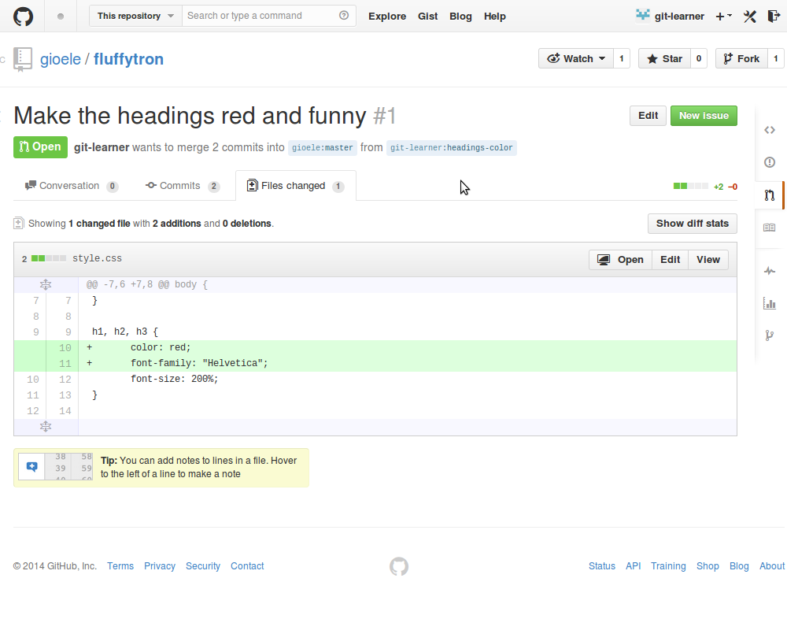

Git collaboration guide
=======================

By [Gioele Barabucci](http://svario.it/gioele); additional information at <http://svario.it/git-collab-guide>.

There are many projects that are developed using git. However, many people
do not contribute to these projects because of git and its reputation as a
difficult tool. To be honest, git is a difficult tool, but if one focuses
only on its main features, it is possible to learn git and be productive
with it in few minutes.

This guide will show you how to use git to contribute to a fictitious
`fluffytron` project. We will set up our own copy of the `fluffytron`
repository then make some changes and see these modifications being
integrated back into the `fluffytron` project.

*NOTE: this is a very opinated guide. It shows only one of the many
ways in which git can be used to collaborate on a project, does not use
100%-correct terminology and ignores many low-level details. Yet it
should provide a useful, down-to-earth, step-by-step guide for beginners.
More advanced users should read instead the [free ProGit book](http://git-scm.com/book).*

The steps
---------
{:.no_toc}

1. To be replaced by the table of contents
{:toc}

First, we need a fork
---------------------

The project `fluffytron` is hosted on GitHub. The URL of the `fluffytron`
project is <https://github.com/gioele/fluffytron>.

That project page is just a nice interface to the underlying git
_repository_. In git parlance, a repository is a directory with a set of
files that contains all the files of a project, plus much information about
all the changes that those files went through. The URL of the `fluffytron`
repository is <https://github.com/gioele/fluffytron.git> (note the `.git`
extension at the end).

We cannot make any modification to that repository. If we want
to make changes we must first make a copy of the main repository, do
the changes we want inside our copy, and then ask the project maintainers
to integrate the changes we made. In git terms, we need to "fork"
the main `fluffytron` repository.

To fork the main repository we use the GitHub interface.

1. 
2. 
3. 

With this procedure we told GitHub to copy the original `fluffytron`
repository from Gioele's workspace to our workspace. Now we have
our own copy of the `fluffytron` project at <https://github.com/git-learner/fluffytron>;
the associated repository is available at <https://github.com/git-learner/fluffytron.git>.

We have our own copy of the repository now, but how do modify the files?
We need to clone this new repository onto our computer.

    $ git clone https://github.com/git-learner/fluffytron.git
    Cloning into 'fluffytron'...
    remote: Counting objects: 17, done.
    remote: Compressing objects: 100% (12/12), done.
    remote: Total 17 (delta 4), reused 17 (delta 4)
    Unpacking objects: 100% (17/17), done.
    Checking connectivity... done.

Git has now downloaded a copy of our own repository in a directory in our
computer. In git terms we just cloned our _remote repository_ into our
_local repository_ (It is slightly confusing, isn't it? It will be clearer
later.)

Let's move into this newly created directory and see what is inside it.

    $ cd fluffytron

TODO: image directory contents

We have a new directory that contains all the files of the project plus a
special directory `.git` that contains all the history of the files and
other pieces of information. The directory as a whole is called the "local
repository". When we take in consideration only the project files proper
(that is, the content of the directory excluding the `.git` directory) we
refer to at as the "working directory".

Putting our repository in contact with the main repository
----------------------------------------------------------

Before we can contribute anything, we have to make our repository "talk"
to the main repository. However, we just began and we already have quite
a bit of repositories to keep track of. Let's pause for a second and have
a look at them.

We have three repositories at hand:

* the main repository: <https://github.com/gioele/fluffytron.git>;
* our remote repository on GitHub: <https://github.com/git-learner/fluffytron.git>;
* our local repository in our computer.

We will operate mostly on our local repository, so, from now on we will
refer to "our local repository" simply as "our repository".

Our repository is already linked to our remote repository. This allows the
changes we make to to our repository to be sent easily to the remote
repository when we are ready to publish them. The address of our remote
repository is stored in the repository configuration files as the "remote
location" called `origin` or, in git terms, as the `origin` remote.

    $ git remote -v
    origin  https://github.com/git-learner/fluffytron.git (fetch)
    origin  https://github.com/git-learner/fluffytron.git (push)

What we need to do now is to link our repository to the main `fluffytron`
repository. We do this adding a new remote. Usually this remote is named
`upstream` or after the person or the organization that manages it. In
this case we will try to be less formal and will call it "gioele".

    $ git remote add gioele https://github.com/gioele/fluffytron.git
    $ git fetch gioele
    From https://github.com/gioele/fluffytron
     * [new branch]      master     -> gioele/master

We are now done with the setup and we can start making changes and ask
to have them integrated into the `fluffytron` project.

Update to align to the main repository
--------------------------------------

Conceptually, the first thing to do before doing any change is to align
our repository to the main repository, to be certain of using the
current versions of the files.

In git one updates a repository by merging it with its master repository
using the "pull" operation.
We will use a particular kind of merge process called "fast-forward only".
"Fast-forward only" in this context means that we want the merge process
to be completely automatic because we expect the integrator to take care
of all the intricacies of the git merging process.

    $ git pull --ff-only gioele master
    remote: Counting objects: 5, done.
    remote: Compressing objects: 100% (1/1), done.
    remote: Total 3 (delta 2), reused 3 (delta 2)
    Unpacking objects: 100% (3/3), done.
    From https://github.com/gioele/fluffytron
     * branch            master     -> FETCH_HEAD
       f6661f5..6f94f76  master     -> gioele/master
    Updating f6661f5..6f94f76
    Fast-forward
     fluffytron.js | 2 +-
     style.css | 2 ++
     2 file changed, 3 insertion(+), 1 deletion(-)

If anything goes wrong and the fast-forward merge cannot be done, you
should tell the maintainer: either they did something wrong (they will fix
that) or you did mess somehow (they will tell you how to sort things out).

Once the merge has been done, we publish the updated state of our
repository to show everybody that we are up to date with the main
repository.

    $ git push
    Username for 'https://github.com': git-learner
    Password for 'https://git-learner@github.com':
    Counting objects: 13, done.
    Delta compression using up to 4 threads.
    Compressing objects: 100% (10/10), done.
    Writing objects: 100% (10/10), 1.15 KiB | 0 bytes/s, done.
    Total 10 (delta 6), reused 0 (delta 0)
    To https://github.com/git-learner/fluffytron.git
       f6661f5..6f94f76  master -> master

A separate branch for our changes
---------------------------------

Before we start making changes, we need to make sure that our modifications
will not collide or pollute other people's work.
In git this is done using separate branches.

A git branch is a copy of the working directory. You can think of
a branch as a "context", different branches are used to separate
different working contexts. In every repository there is a main branch
called `master`. Project collaborators should never touch the `master`
branch, as it is meant to be used only by the project maintainers that
have (or should have) the technical knowledge and the expertise
required manage that branch.

Contributors should create a "feature branch" every time they want to
change something. In our case we want to change the color of the headings
of the `fluffytron` project; we create a new branch called `headings-color`
based on the `master` branch.

    $ git branch headings-color

Creating a branch is not enough, we also have to switch to it, so that
our modifications will be recorded in it instead of in the master branch.
Switching to a branch is called doing a "checkout" of that branch.

    $ git checkout headings-color
    Switched to branch 'headings-color'

Please note that we did create a new branch now, but that branch exists
only in our local repository. We need to let the world know we did create
it. To do so, we need to publish the new branch on our remote repository.
In git publishing is done via "push" operations.

    $ git push --set-upstream origin headings-color
    Username for 'https://github.com': git-learner
    Password for 'https://git-learner@github.com':
    Total 0 (delta 0), reused 0 (delta 0)
    To https://github.com/git-learner/fluffytron.git
     * [new branch]      headings-color -> headings-color
    Branch headings-color set up to track remote branch headings-color from origin.

We are now ready to make our first change and publish it.

Our first commit
----------------

We can now change the color of the headings to something more cool,
from black to red, and we can also change the font to Comic Sans.

TODO: picture CSS changes

This change has been saved in the working directory but has not been
recoded in the project history. To do so we need to "commit" our change.
To commit means to tell git that we did change some files and that we
want that changes recorded, accompanied by a short title that describes
the changes and an optional longer message that explains why we made
these changes. For such a simple modification we will use only the short
title "Make headings red and funny".

    # first we tell git that we changed some files
    $ git add style.css
    # then we commit the changed files
    $ git commit -m "Make the headings red and funny"
    [headings-color e0b326d] Make the headings red and funny
     1 file changed, 2 insertions(+)

Publishing our change
---------------------

The commit we just created is sitting in the repository in our computer. Our
remote repository does not know about it, let alone the maintainers of
`fluffytron`.

So, it is time to publish our commit and then request its
integration in the main project.

The git way to publish a commit is pushing it to the remote repository,
exactly the same operation we did to to publish our new `headings-color`
branch. Please note that git cannot push single commits, only complete
branches. Thus, what we have to do now is to publish the new state of
our `headings-color` branch.

    $ git push
    Username for 'https://github.com': git-learner
    Password for 'https://git-learner@github.com':
    Counting objects: 5, done.
    Delta compression using up to 4 threads.
    Compressing objects: 100% (3/3), done.
    Writing objects: 100% (3/3), 344 bytes | 0 bytes/s, done.
    Total 3 (delta 2), reused 0 (delta 0)
    To https://github.com/git-learner/fluffytron.git
       f6661f5..e574d48  headings-color -> headings-color

Please note that git knows where to publish this branch (in the branch
of the same name in the `origin` remote) because it remembers that
location from when we created and pushed the branch at the beginning.

We can have a look at the GitHub page and see that the changes are
indeed there. Nice.

1. 
2. 
3. 
4. 

Let's request the integration of our changes
--------------------------------------------

With our `headings-color` branch published, we can now request its
integration in the main repository.

git doesn't have a standard way to request the integration of external
changes; we will resort to using GitHub "pull requests".

1. 
2. 
3. 

When we create a pull request, what happens is that GitHub creates for
us a new issue in the issue tracker of the `fluffytron` project. That
issue says that we have a branch called `headings-color`
and we would like to have it integrated into the main repository. In addition,
GitHub also sends some email(s) to the `fluffytron` maintainers to let them
know that there is a new pull request waiting to be integrated.

Making adjustments to a published branch
----------------------------------------

In these trying times, not every pull request gets accepted at the first
attempt. Sometimes the maintainers like most of the changes we submitted
but ask for some adjustments to be done.
In our case, the integrator does not fancy our use of Comic Sans: too
childish.

1. 
2. 

So we go and change that to a more boring but more appropriate Helvetica.
What don't you do to please these maintainers...

Before making any adjustment to our changes, we make sure that we are
still in the `headings-color` branch. (In the meantime we may have worked
on something else, so we could have switched to other branches.)

    $ git checkout headings-color
    Already on 'headings-color'
    Your branch is up-to-date with 'origin/headings-color'.

Now we can proceed and make the adjustments that have been requested.

TODO: illustration of CSS changed to Helvetica

Just like before, we tell git about the changed files and make a commit.

    $ git add style.css
    $ git commit -m "Helvetica is a more appropriate font"
    [headings-color 2ea5e8e] Helvetica is a more appropriate font
     1 file changed, 1 insertion(+), 1 deletion(-)

Again just like before, we push the `headings-color` branch to our remote
repository.

    $ git push
    Username for 'https://github.com': git-learner
    Password for 'https://git-learner@github.com':
    Counting objects: 7, done.
    Delta compression using up to 4 threads.
    Compressing objects: 100% (3/3), done.
    Writing objects: 100% (3/3), 323 bytes | 0 bytes/s, done.
    Total 3 (delta 2), reused 0 (delta 0)
    To https://github.com/git-learner/fluffytron.git
       e0b326d..2ea5e8e  headings-color -> headings-color

This is exactly what we have done for our first commit. The only difference
is that now we do not need to issue a new pull request. The original pull
request, being linked to the `headings-color` branch, has automatically
been updated to contain both the old and the new commit. The final result
is a combination of the two commits, as can be seen in the GitHub page for
the pull request.

1. 
2. 
3. 

After the change has been accepted
----------------------------------

Finally, the integrators have accepted our changes and merged them into
the main repository. This can be seen clearly in the project history. See
the small bump ending in "Merged new heading styles from git-learner"?

TODO: image commit log

We must now do two things to consider our work done: deleting the
`headings-color` branch and update our repositories to reflect the
advances made by the `fluffytron` project.

We start deleting the `headings-color` branch because it is useless now
that has been integrated in the main repository.

We follow the GitHub suggestion to delete the branch...

1. 
2. 

...then we switch back to the master branch and remove the
`headings-color` branch from our repository.

    $ git checkout master
    Switched to branch 'master'
    Your branch is up-to-date with 'origin/master'.
    $ git branch -D headings-color
    Deleted branch headings-color (was 2ea5e8e).

It is a good practice to also update our repository as explained in
"Update to align to the main repository".
This reduces the chances of having problems during future updates.

We are done. Next time we want to submit a change we can skip all the
preparatory steps and start directly with the update of our master branch
and the creation of a new branch.

Good work!
